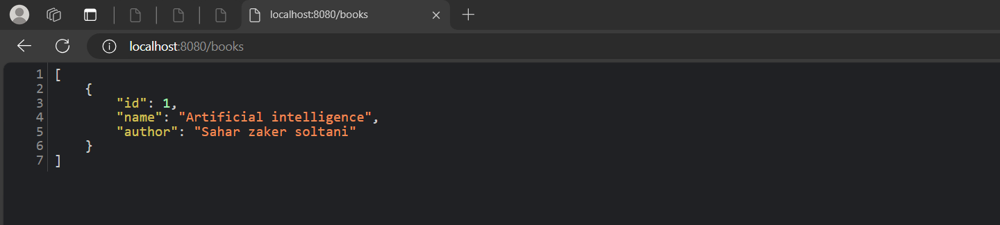

# Books information Spring Boot 

This is a **Spring Boot** application designed to manage books.

## Features
- Add, update, delete, and view book details.
- Follows the **MVC architecture**.
- Uses **Spring Data JPA** for database interactions.
- RESTful API support.

## Technologies Used
- Java 17
- Spring Boot
- Spring Data JPA
- H2 Database (or other configured database)
- Maven

## How to Run
1. Clone the repository:
   ```bash
   git clone https://github.com/saharzakersoltani/Books-spring-boot.git
   cd Books-spring-boot

2. Build the project:
   ```bash
   mvn clean install

3. Run the application:
   ```bash
   mvn spring-boot:run

4. Access the application at:

   - API Base URL: http://localhost:8080/api/books
   - H2 Console (if enabled): http://localhost:8080/h2-console

  ## Screenshots
  
    
  
   
